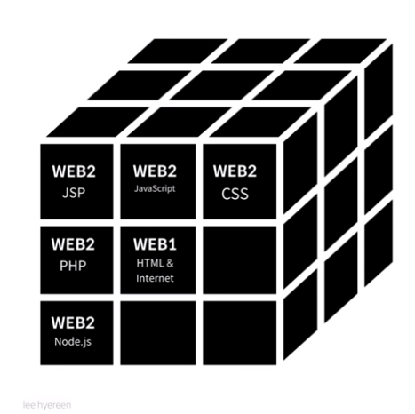

# 생활코딩 코딩야학 3기 WEB 정주행 

🏃‍♀🏃🏃‍♀🏃🏃‍♀🏃🏃‍♀🏃🏃‍♀🏃‍♀🏃🏃🏃‍♀🏃🏃‍♀🏃🏃‍♀🏃🏃‍♀🏃🏃‍♀🏃🏃‍♀

## THEME : WEB 

<br><br>


#### 2강. 프로젝트의 동기  

=>재밌게 공부하자!!!!

<br><br>


#### 3강. 기획 

=> 항목을 클릭하면 컨텐츠와 사진 동영상이 나오는 웹사이트를 만들 수 있도록 동영상이 기획되었음.

<br><br>


#### 4강. 코딩과 HTML

=>  HTML이란? 

​	**Hyper Text Markup Language** 

​	public domain적인 특징을 가진다.

<br><br>


#### 5강. HTML 실습환경 준비

=> HTML학습을 위해 필요한 두 가지!!

​	웹브라우저 & 에디터(atom, brakets)

=> 디렉토리 설정 및 실행

​	바탕화면에 web 디렉토리 만들기

​	atom 으로 html파일 생성.

​	크롬에서 ctrl+o 눌러 웹브라우저에서 파일 열기.

​	(실행해가면서 모양확인!)

<br><br>


#### 6강 . 기본문법 - 태그

=>자기자신이 주인공이 되라 !

​	자신이 원하는 컨텐츠로 웹페이지 만들기

=> TAG란? 딱지 ,설명해주는 것

​	컴퓨터 공학이란 하나의 시!

​	물질 기반이 아닌 비유 기반

<br><br>


#### 7강. 혁명적인 변화

=>태그

태그를 알게 되었다! == 내가  무엇을 모르는 지 알게 되었다는 뜻! 

(실행을 해보면서 무슨 기능인지 찾아볼 수 있게 되었다.)

이동할 필요없이 검색엔진으로 모든 것을 알 수 있는 시대.

학습의 혁명적 변화!!!

<br><br>


#### 8강. 통계에 기반한 학습

=> 150 + 개의 태그 종류

통계적으로 많이 활용되는 html 태그부터 공부합시다.

html태그 통계 사이트!

https://www.advancedwebranking.com/html/

<br><br>


#### 9강.줄바꿈.

```html
<br></br>
<p></p style="margin-top:40px;">
:style을 매기는 것은 css
```

<br><br>


#### 10강. HTML이 중요한 이유

```html
<span style="font-size:24px">
	coding
</span>
	vs
<h1>coding<h1>
  :제목으로 설정된 것이 좋다. 검색엔진에서도 유리. 
```

<br><br>


#### 11강. 최후의 문법 속성과 img

img 태그 같은 경우는 태그의 이름 속성으로만 충분하지 않다. 이미지 주소써주어야함.

<br><br>


#### 12강. 부모자식과 목록

```html
<parent>
	<child></child>
</parent>

부모태그-자식태그의 예 
<ul>
  <li></li>
</ul>

+<ol></ol> 이 들어가면 숫자가 붙는다.
+ Atom editor Tip. ctrl 커서 누르고 클릭한 후 한꺼번에 <li> 쓸 수 있음.  
```

<br><br>


#### 13강. 문서의 구조와 슈퍼스타들

```html
<title>제목</title>
title은 책 표지와 같이 인지하므로 검색 등에 반영된다. 따라서 title을 쓰는 것이 좋다. 정보가 있어도 검색에 노출이 안되면 의미가 없습니다!
<meta charset="utf-8"> 캐릭터셋을 utf-8 방식으로 저장하였다.
```

html구조(외우기! 제로 베이스에서 칠 수 있을 만큼!)

```html
<!doctype html>
<html>
  <head>
    <title></title>
    <meta charset="utf-8">
  </head>
  <body>
  </body>
</html>
```

<br><br>


#### 14강.HTML 태그의 제왕

이 태그가 없다면 정보혁명이 시작되지 않았을 것이다. 무슨 태그?

```html
<a></a>
href = hypertext referencing
anchor: 정보의 바다에 닻을 내린다. 링크태그!!!
```

<br><br>


#### 15강 웹사이트 완성

```html
<a href></a>태그를 통해서 템플릿을 이어주는 방법.
```

<br><br>


#### 16강. 원시웹

=> internet vs web

​	인터넷이 도로라면 웹은 그 위를 달리는 자동차 하나!

​	internet <= FTP, WEB, email 등등 포함..

​	http://info.cern.ch/ : 웹의 메소포타미아! 최초의 페이지

<br><br>


#### 17강.인터넷을 여는 열쇠: 서버와 클라이언트

두 대 부터 인터넷 가능!

=>웹서버를 사용할 수 있다는 것의 의미

​	내 컴퓨터에 있는 모든 정보를 전세계로 공유할 수 있다.

=>웹서버를 사용하는 법

​	1.web hosting

​		대행 업체에 맡기기

​	2.web server

​		설치(apache...)

=> 서버와 클라이언트의 개념!


<br><br>


#### 18강. 웹호스팅(github pages)

=> github page 웹호스팅

​	setting - git hub pages - none to master

​	static web hosting이다 rails 같은 경우 dynamic webhosting 필요!

​	[진행중인 github pages 주소](https://genieyoo.github.io/code-night3rd/)


=> 타 웹 호스팅 services

```html
	1.https://ww.bitballon.com/

	2.http://neocities.org/

	3.Amazon S3

	4.Google Cloud Strorage

	5.Azure Blob

```

<br><br>


#### 19강. 웹서버 운영하기

=>Apache

​	how to install apache http server os

​	19 1.1 윈도우에 웹서버 설치

​	bitnami wamp stack설치하면 설치됨.

<br><br>


#### 19 1.2 웹서버와 http

=> 이 파일이 어디에있을까?

​	http://127.0.0.1/index.html

​	C:\Bitnami\wampstack-7.1.12-0\apache2\htdocs 안에 있다.

​	이 폴더 안에 우리가 작업한 웹파일들을 넣는다.

=>지금 상황?


​	한대의 컴퓨터 안에 웹브라우저와 웹 서버가 같이 있다.

​	server에서 정보를 읽어서 뿌려주기에 

​	주소 http://127.0.0.1/index.html

​	http? = hyper text language protocol


=>이전에 ctrl + o는 그냥 웹브라우저에서 여는 것. 서버연결 없음

​	file:///C:/Users/Administrator/Desktop/web/index.html

<br><br>


#### 20-22. 수업을 마치며

​	간단한 것 부터 다가서기!

​	web front end engineer

​	web interactive designer

​	backend(생산성을 높이기 위해!)



<br><br>


#### 부록:동영상 삽입

=> 유튜브 소스코드 iframe 코드를 이용하여 동영상 삽입하기

<br><br>


#### 부록: 코드의 힘 - 댓글 기능 추가

=>disqus 의 코드를 삽입하여 댓글기능 추가!

<br><br>


#### 부록: 코드의 힘 - 채팅기능 추가

=> tawk의 코드를 삽입하여 채팅기능 추가!

<br><br>


#### 부록: 코드의 힘 - 방문자 분석기

=> google analytics를 활용한 방문자 추적

<br><br>


향후 계획 : 웹페이지 발전 개발!